# Architecture

How this application is put together, and **why** each seam is where it is. It is the map you want
before your first change; it is not a tutorial and it is not a substitute for the header comment on
the file you are about to edit — every module here carries one, and where this document and that
comment disagree, **the comment is right**, because it lives next to the code.

Five documents already exist and this one deliberately does not repeat them:

| Read that instead | For |
|---|---|
| [`CONTRACT.md`](./CONTRACT.md) | The rules a file must obey — colour, motion, accessibility, z-index, `cn()`, permissions. Non-negotiable. |
| [`DEPLOYMENT.md`](./DEPLOYMENT.md) | Getting it running on Vercel or in a container; every `vercel.json` key; the two database URLs. |
| [`OPERATIONS.md`](./OPERATIONS.md) | Bucket CORS, environment variables whose absence is *silent*, backups, the verification suite. |
| [`SIGN-IN.md`](./SIGN-IN.md) | The studio access list as an administrator experiences it — adding, revoking, the master-admin rule. |
| [`OUTSTANDING.md`](./OUTSTANDING.md) | What was once broken and what now prevents each class of it recurring. Nothing is outstanding; the *shape* of the failures is why the checks in §6.5 exist. |

Two companions sit beside this one: [`DATA-MODEL.md`](./DATA-MODEL.md) for the entities and their
relationships, and [`REQUEST-LIFECYCLE.md`](./REQUEST-LIFECYCLE.md) for what happens between a
keystroke and a row.

---

## 1. System context

One Next.js 15 application (App Router, React 19), one PostgreSQL database reached through Prisma,
one S3-compatible object store. There is no second service, no queue, no cache tier and no search
engine — and every one of those absences is a decision recorded below rather than a gap.

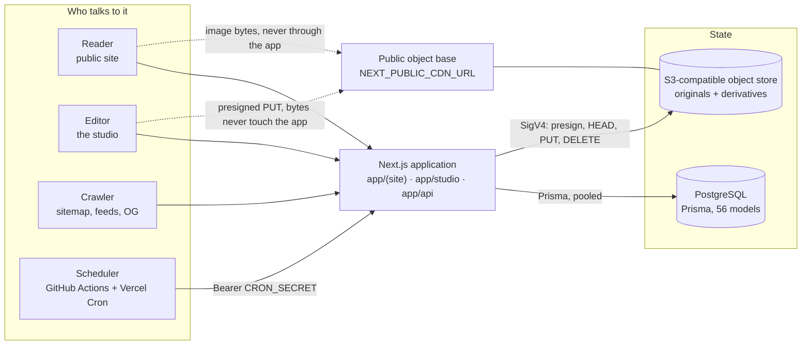

**Two arrows are dotted, and they are the load-bearing ones.** Image bytes and upload bytes never
pass through the application server. A reader's `` resolves to `NEXT_PUBLIC_CDN_URL/<object
key>` (`publicObjectUrl` in `lib/media/url.ts`) and an editor's upload is a signed `PUT` straight at
the store (`lib/client/upload.ts`). That is what makes a 200 MB video upload possible at all inside a
serverless function, and it is also why the bucket's CORS policy — not the application — decides
whether uploads work (`OPERATIONS.md` §1).

### 1.1 The two live deployment targets

Both are supported, both are documented in `DEPLOYMENT.md`, and the code is identical on both. What
differs is how many copies of the process exist, and therefore what in-process state means.

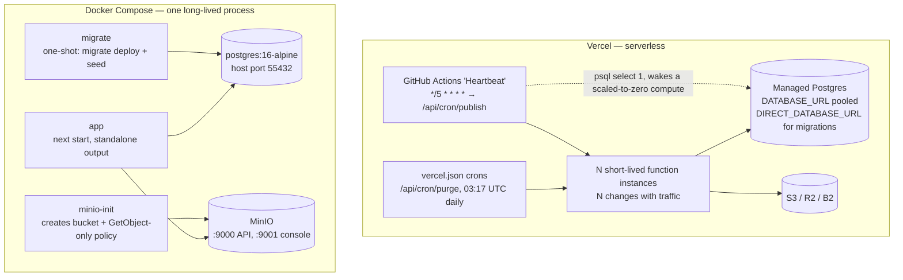

Three consequences of that split are worth carrying in your head, because each has bitten:

- **In-process state is per instance on Vercel and global in the container.** Two features rely on a
  `Map` on `globalThis` and both say so in their own headers: the live-preview draft store
  (`lib/pages/preview-draft.ts`) and the rate limiter's default bucket (`lib/ratelimit.ts`). On
  Vercel the builder's `PUT` and the preview's `GET` can land on different instances, so the preview
  falls back to the last saved page **and renders `PREVIEW_DRAFT_FALLBACK_NOTICE` saying so**. A
  degradation that is announced is acceptable; a silent one is not. `lib/runtime.ts` computes which
  world it is in (`runtimeKind()`) and prints the warnings into Studio → Settings → Diagnostics.
- **The two MinIO addresses are not a mistake.** The server reaches storage at `http://minio:9000`
  over the compose network; the browser must be given `http://localhost:9000`. SigV4 signs the `Host`
  header, so a URL cannot be rewritten after signing — `signer()` in `lib/storage/client.ts` builds a
  *second* `S3Client` configured with `S3_PUBLIC_ENDPOINT` so the signature covers the host the
  browser will actually send. Rewriting instead yields `SignatureDoesNotMatch`, which reads as a
  credentials problem and costs an afternoon in IAM.
- **`output: "standalone"` is switched on only in the container build** (`Dockerfile`, builder
  stage). Vercel does its own output handling; see `DEPLOYMENT.md` §2.2.

### 1.2 Route groups, and the one place a request is intercepted

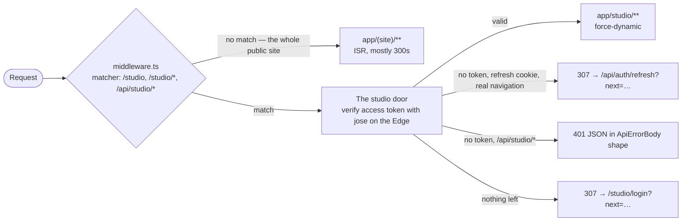

**Middleware runs on the Edge, which decides what it may import.** `jose` verifies the access token
with WebCrypto and runs there; Prisma does not run there at all. So `middleware.ts` must never import
`lib/db.ts` — nor `lib/api.ts`, `lib/audit.ts` or `lib/auth/current-user.ts`, which pull it in
transitively. That is why its 401 body is written out by hand and must stay byte-compatible with
`ApiErrorBody`.

**The token's `role` claim is for routing only.** A token minted before a demotion stays valid for up
to its 30-minute TTL, so every read and every write inside the studio re-reads the authoritative role
from the database through `requireUser()` / `requireRole()` / `requireCapability()` in
`lib/auth/current-user.ts`. Gating a capability on `claims.role` in middleware would build a
permission that is up to half an hour out of date.

**The public site is never touched by middleware**, and that is what makes ISR work at all — and also
why `next.config.ts` ships a deliberately partial Content-Security-Policy with no `script-src`: a
meaningful one needs per-request nonces, and getting a nonce to the pre-paint theme boot
(`lib/preferences.ts`, a blocking inline script that is the first child of `<body>`) would mean
routing every public request through middleware. An honest gap beats a decorative header with
`'unsafe-inline'` in it.

---

## 2. The section rendering pipeline

This is the heart of the CMS and it deserves the most space. **A page is not a file.** A `Page` row
owns routing, SEO and publication state; its content is an ordered list of `PageSection` rows, each
one a `SectionType` plus a JSON payload. `app/(site)/[...slug]/page.tsx` serves `/about`,
`/about/history` and `/research/roadmap` out of the same builder, and
`app/(site)/page.tsx` — the homepage — is a `Page` row whose slug is the empty string.

Adding a block type is **five files and no migration**: a value in the Prisma `SectionType` enum, a
Zod schema in `lib/sections/schema.ts`, a palette entry in `lib/sections/registry.ts`, a renderer in
`components/sections/`, and an editor form in `components/studio/sections/`. There are 32 of them
today.

### 2.1 The pipeline, end to end

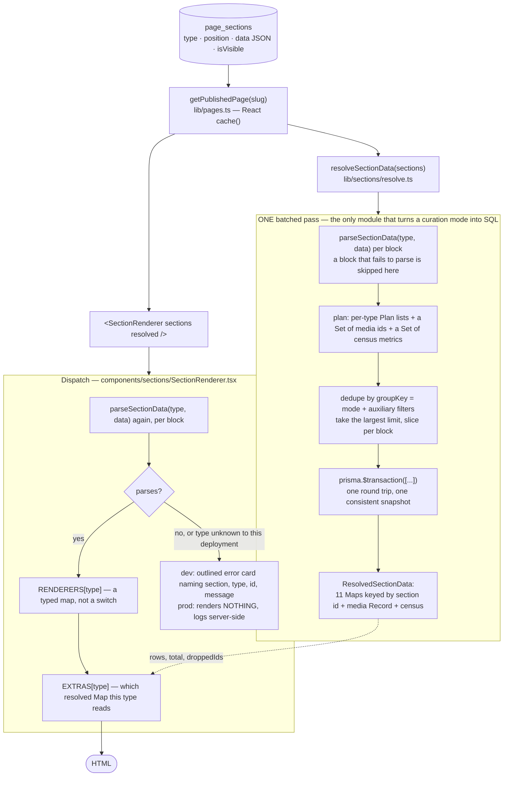

**Why the payload is parsed twice.** The resolver parses to decide what to fetch; the renderer parses
to decide what to draw. They are two different questions asked at two different moments, and both
must fail closed. Zod strips unknown keys and fills every default on the way through, so the second
parse is cheap and its result is the value the renderer is typed against.

### 2.2 The four corners, and why none of them can drift

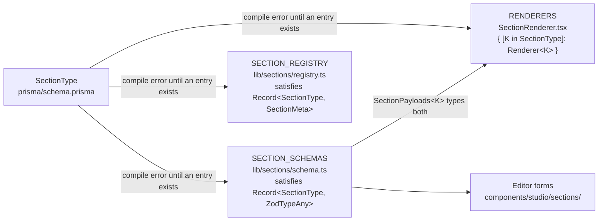

⚠ **`satisfies`, never a type annotation.** An annotation would flatten every value to `ZodTypeAny`
and lose the per-type inference `SectionPayloads` is built from; `satisfies` keeps the inference *and*
still fails the build the moment a value is added to the enum without an entry. A `switch` with a
`default` would have compiled happily and shipped a gap — which is exactly the bug class
`docs/OUTSTANDING.md` was written about.

### 2.3 Six rules that run through `lib/sections/schema.ts`

Each is a bug it prevents, and they are why a five-year-old payload still renders:

1. **No `server-only`.** The studio's editor forms validate with these same schemas in the browser,
   so the module must be isomorphic. That is also why the Zod-error flattening is duplicated here
   rather than imported from `lib/api.ts` — the *shape* it produces is deliberately identical to
   `ApiErrorBody.fieldErrors`, so a section failure renders through the same form-error components as
   any other API failure.
2. **Every field has a default.** A payload written before a field existed still parses, gaining the
   new field's default. Without this, adding a property would turn every block already in the
   database into an error card — a silent, delayed, site-wide break.
3. **Optional text is `""`, never `undefined`.** Studio forms are controlled React state; `undefined`
   flips an input to uncontrolled and warns.
4. **Almost nothing is conditionally required.** Autosave fires every few seconds, so a rule that
   bites mid-edit refuses the save while the editor is still working. Where a value is genuinely
   missing, the **renderer** says so on screen (contract §1.6). There are exactly two exceptions —
   the `EMBED` and `FORM_EMBED` titles — and both are accessibility requirements: a screen reader
   announces an untitled `<iframe>` as "frame". `FORM_EMBED` carries one more, a host allow-list,
   which is a security requirement.
5. **Every on-screen string carries a `.max()` and a `.describe()`.** The max is a length a human
   would choose; the description is the inline help the editor form renders beneath the field.
6. **Payloads are flat and JSON-serialisable.** No `Date`, no `Map`, no class instances — the value
   lands in a Postgres `Json` column. ⚠ A date is stored as the string `<input type="date">`
   produces, and it is validated by counting the day against the real length of that month:
   `Date.parse` accepts `2026-02-31` and rolls it silently to 3 March, so a closing date typed one
   digit wrong would save and then display as a different day with nothing anywhere saying so.

### 2.4 The resolver: three curation modes, and the one that is easy to get wrong

Showcase blocks (`PROJECT_SHOWCASE`, `NEWS_SHOWCASE`, `PUBLICATION_LIST`, `CRAFT_EXPLORER`, …) pull
records from elsewhere in the CMS and keep themselves current.

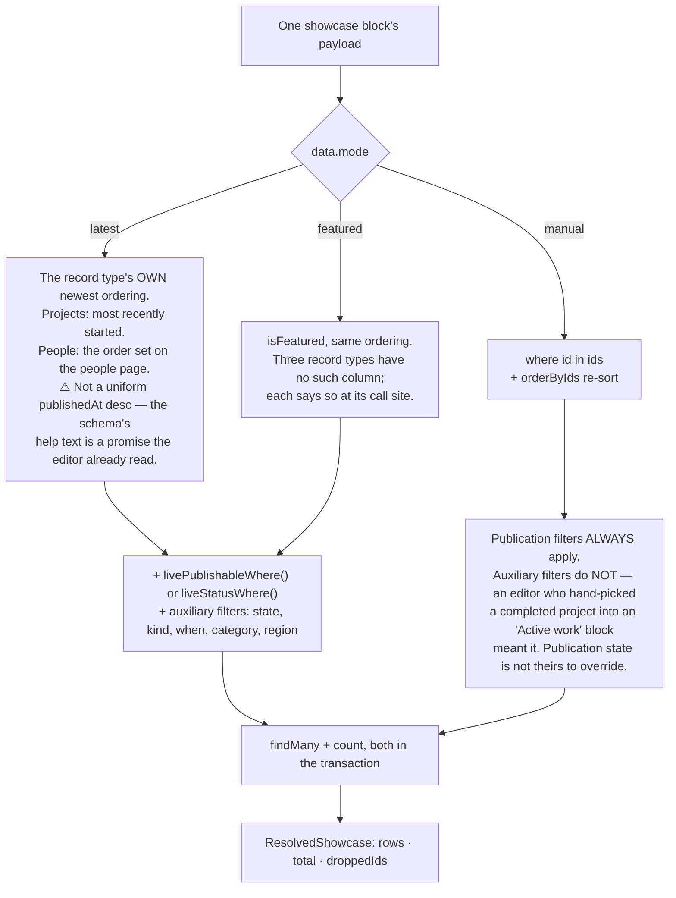

⚠ **`orderByIds` is not tidiness.** Postgres returns rows from an `IN` list in index order, never in
the order of the list. Without the re-sort, a hand-curated block would silently ignore the
arrangement the editor dragged into place — the single most confusing bug possible in a page builder,
because everything looks saved and nothing looks broken.

Three fields come back per block, and each answers a question a renderer cannot answer alone:

- **`rows`** — already limited, already in the right order.
- **`total`** — how many matched *ignoring* `limit`. Every showcase's `limit` help text promises
  "where there are more, the block says how many, so a shortened list never reads as the whole list"
  (contract §1.6), and a renderer cannot keep that promise without the count. So every automatic
  group runs a `count` beside its `findMany`.
- **`droppedIds`** — hand-picked ids that no longer resolve, so the studio's preview can say "2 of
  the items you picked are no longer published" instead of quietly rendering a shorter row.

Two more properties of the batched pass:

- **One `now` for the whole page.** Computed per query, a post published in the millisecond between
  two statements could appear in one block and not in another on the same render.
- **An unreachable database resolves to EMPTY rather than throwing**, and the guard sits at the
  boundary of `resolveSectionData` rather than around each of the dozen queries inside — one `catch`
  cannot be forgotten when a fourteenth showcase type is added; twelve can. Every showcase renderer
  already handles an empty row set, because it is the same state as a curation that matches nothing.
  It has to degrade this way: `next build` renders the pages that call this, and a throw would fail
  the whole deploy for a reason unrelated to the change being shipped (`lib/prerender.ts` argues the
  same case at length).

### 2.5 What a broken block does

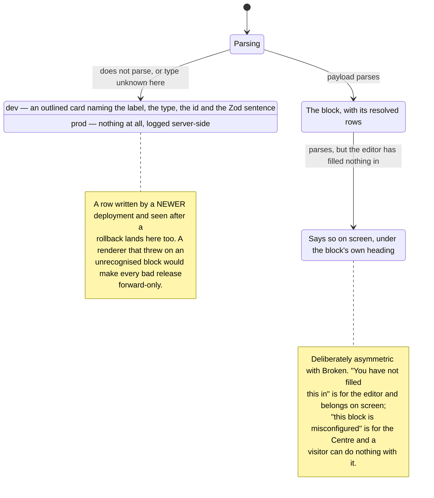

### 2.6 Where a page's `<h1>` comes from

`app/(site)/[...slug]/page.tsx` has no hero of its own, so the only heading it can have is one a
block draws — and the only block that draws an `<h1>` is a `HERO` **with a headline in it**
(`sectionsOwnPageTitle`). A page that opens with a text block would otherwise have no title in the
document at all and every heading on it would start at level 2. The route supplies the page title as
a **visually hidden** `<h1>` in exactly that case: a visible band would change the design of every
page that opens with text, and where that text repeats the title it would print it twice.

---

## 3. The studio's publishing lifecycle

`ContentStatus` has five values and they mean five different things. **Publication is resolved at
READ time, not by a job** — `livePublishableWhere()` and `liveStatusWhere()` in `lib/content.ts`
compare `publishAt` / `unpublishAt` against `now` on every query. The cron is a convenience; the
filters are the mechanism.

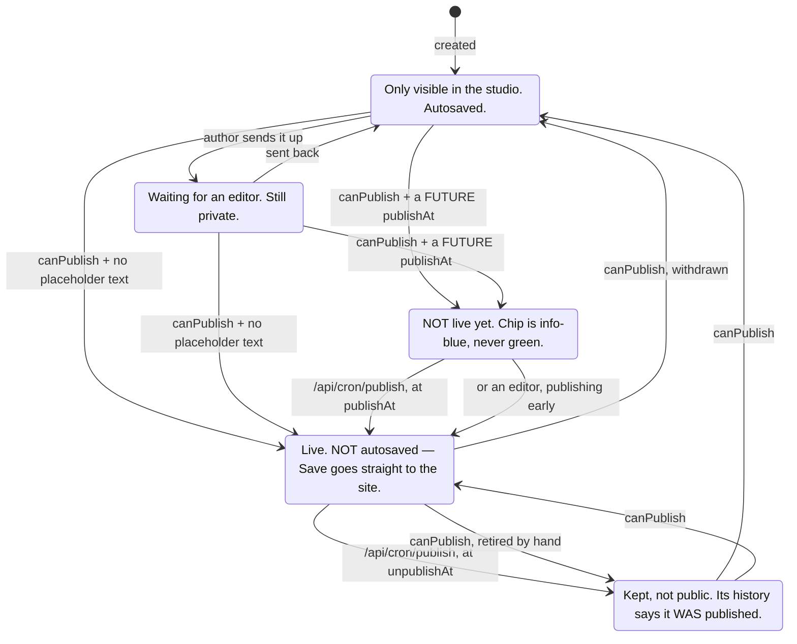

### 3.1 What advances each transition

```mermaid
flowchart TB
    subgraph human["A person, through PATCH /api/studio/pages/[id]"]
        h1["publishTransition() — lib/studio/crud.ts"]
        h2["Rule 1: crossing the live line needs canPublish.<br/>Editing an already-published row does NOT —<br/>an author fixing a typo on their own live article<br/>must not be told they need publishing rights."]
        h3["Rule 2: SCHEDULED needs a date, and a NEW<br/>schedule needs a FUTURE one. A row scheduled for<br/>yesterday is already live, so refusing to save it<br/>would strand a page in front of readers."]
        h4["Rule 3: publishedAt is set on the FIRST publish<br/>only, and never cleared. A re-publish must not<br/>rewrite the article's claim about when it appeared."]
        h5["Rule 4: a model with no publishAt column<br/>cannot be SCHEDULED. Only Page and Post have it."]
        h6["pagePublishBlockers() — lib/pages.ts<br/>⚠ going public is REFUSED while a VISIBLE block<br/>still holds one of the studio's own prompts.<br/>The refusal QUOTES the words, so the editor can<br/>find them with the browser's own search."]
        h1 --> h2 --> h3 --> h4 --> h5 --> h6
    end

    subgraph robot["The scheduler, through GET /api/cron/publish"]
        c1["assertCronAuthorised() — constant-time bearer,<br/>and REFUSES when CRON_SECRET is unset"]
        c2["SCHEDULED → PUBLISHED where publishAt ≤ now.<br/>publishedAt is stamped with the SCHEDULED time,<br/>not with now — the article's own claim must not<br/>drift by however late the job ran."]
        c3["PUBLISHED → ARCHIVED where unpublishAt ≤ now.<br/>ARCHIVED, not DRAFT: it WAS published and its<br/>history should say so."]
        c4["resyncPublishedFlags() — recompute the search<br/>index's isPublished from the source rows"]
        c5["Events that have ENDED are left alone, on purpose.<br/>A past event is part of the record."]
        c1 --> c2 --> c3 --> c4 --> c5
    end

    subgraph reader["Every public query, on every request"]
        r1["livePublishableWhere() / liveStatusWhere()<br/>compare against now"]
        r2["So: a stalled cron cannot leave an expired embargo<br/>readable, a scheduled piece goes live at its minute<br/>with nothing running, and a deployment with NO cron<br/>configured still behaves correctly."]
        r1 --> r2
    end
```

**What the job actually buys is honesty in the studio.** Without it the status column would read
"Scheduled" for a piece that has been public for a week, and the audit log would have no record of
the moment it changed — both of which matter to whoever has to answer "when did this go up?".

`resyncPublishedFlags` is not an afterthought. `SearchDocument.isPublished` is computed at *write*
time while publication is resolved at *read* time, so it goes stale with nothing more than the clock
advancing: a page past its `unpublishAt` 404s at its own URL while its title keeps coming back from
`/search`, and a scheduled article goes live but stays missing from the site's own search until
somebody re-saves it.

### 3.2 ⚠ Where the publish cron actually runs

**`/api/cron/publish` runs from GitHub Actions, not from `vercel.json`.**

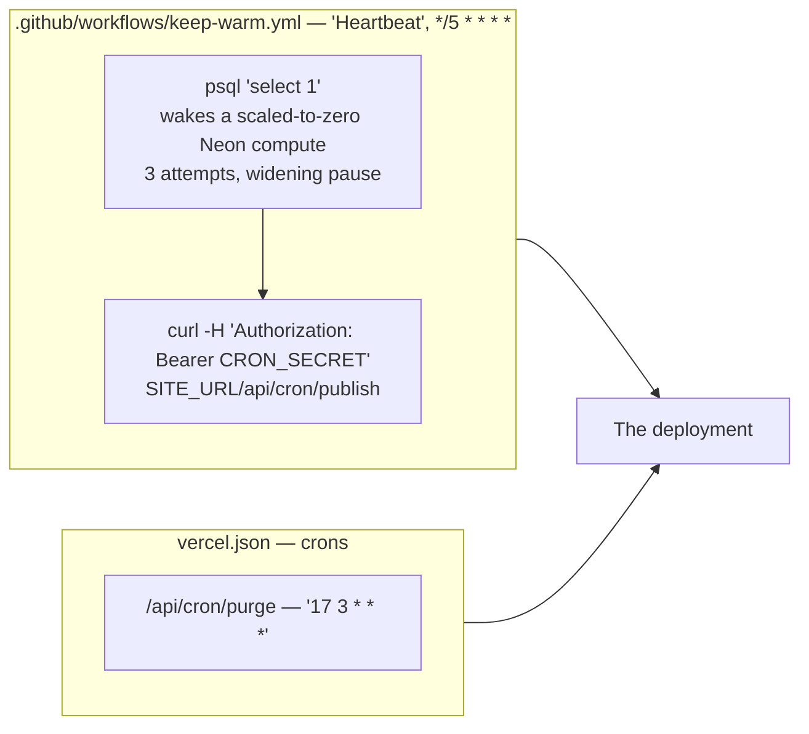

The reason is blunt: **the Vercel Hobby plan refuses any cron that fires more than once a day** — the
deploy is rejected outright with `Hobby accounts are limited to daily cron jobs` — so a page an
editor scheduled for 10:00 would not appear until the following night. `/api/cron/purge` stays in
`vercel.json`, because daily is all it ever wanted. The workflow's own header records three things it
cannot do, and they are worth reading before relying on it: GitHub's scheduler is best-effort and
routinely fires ten to sixty minutes late, so scheduled publishing is accurate to roughly a quarter
of an hour rather than to the minute; a compute that never sleeps burns about 730 compute-hours in a
30-day month, which is past what a free Neon plan includes; and **GitHub silently disables scheduled
workflows in a repository with no activity for 60 days**.

> `DEPLOYMENT.md` §1.7 still describes both crons as `vercel.json` entries with the publish job on
> `*/10 * * * *`. That is the arrangement this repository shipped with; the file above supersedes it
> for the publish job only. Update §1.7 when you next touch it.

### 3.3 The editing loop, and why a published page is treated differently

`components/studio/builder/PageBuilder.tsx` holds the working copy of every block and is the only
thing that does. Four kinds of write leave it:

| Change | Shape | Why |
|---|---|---|
| Content — the words, the label, the on/off switch | `useAutosave`, ~4 s after the last keystroke, sending **only the blocks that differ** | A page of forty blocks must not re-send forty payloads because one word changed. |
| Structural — add, copy, delete | Its own immediate request | Somebody who has just pressed Delete expects it gone, not gone in four seconds. |
| Reorder | **One** request carrying the whole new order | `@@unique([pageId, position])` plus a dense 0-based ordering means N updates can interleave; two blocks then claim one position and the constraint refuses one *after* some of the others have landed. |
| Live preview draft | `PUT /api/studio/pages/[id]/preview-draft`, 400 ms after the last change | Writes nothing down. See §6.3. |

**A published page is not autosaved.** A page's blocks have only one copy, so there is no draft to
put the change in — Save goes straight to the live site, and the screen says so by name. A block
added to a live page is therefore created **hidden** by the server, and the row's eye toggle is how
the editor turns it on once the words are real.

**An optimistic reorder rolls back to what the server last confirmed**, not to what was on screen a
moment ago. If two reorders were made quickly and the second failed, "a moment ago" is the first one
— which the server may or may not have.

`ContentLock` is **advisory** and `/api/studio/locks` always answers 200. A lock that blocked editing
would strand content: the tab that took it crashes, the editor goes on leave, and a page nobody can
open is a page nobody can fix. TTL is 5 minutes, refreshed by a 60-second heartbeat, and a heartbeat
is deliberately **not** audited — sixty entries an hour per open editor would bury a log that is only
ever read during an incident. A take-over *is* audited, and filed against the content rather than the
lock row.

---

## 4. Media

### 4.1 Upload → presign → derivatives → delivery

```mermaid
sequenceDiagram
    autonumber
    participant B as Browser<br/>lib/client/upload.ts
    participant A as App
    participant S as Object store
    participant D as Postgres

    B->>A: POST /api/studio/media/presign<br/>{ fileName, contentType, byteSize, kind }
    Note over A: requireCapability(canManageMedia)<br/>ALLOW-LIST of content types, never a deny-list<br/>200 MB cap, server-side and authoritative<br/>buildObjectKey: media/YYYY/MM/&lt;16 hex&gt;-slug.ext<br/>NOTHING is written to the database here
    A-->>B: { uploadUrl, headers, objectKey, expiresInSeconds: 900 }

    B->>S: PUT uploadUrl — the raw File, headers replayed VERBATIM
    Note over B,S: XMLHttpRequest, not fetch — fetch still cannot report upload progress.<br/>Stall watchdog resets on every progress event: 60 s idle, then 5 min<br/>grace after the last byte, because storage emits nothing while it finalises.<br/>3 uploads at a time.
    S-->>B: 200

    B->>A: POST /api/studio/media/complete<br/>{ objectKey, fileName, contentType, byteSize, folderId? }
    Note over A: 1. headObject FIRST — refuse when the object is absent<br/>2. cross-check the reported size; on mismatch DELETE the object<br/>3. the key must match ISSUED_MEDIA_KEY exactly<br/>4. SHA-256 duplicate check — never the filename<br/>5. generateDerivatives, sequentially<br/>6. row + variants + revision + audit in ONE transaction
    A->>S: GET the object, then PUT thumb/sm/md/lg/xl/og × avif,webp
    A->>D: MediaAsset + MediaVariant[] + Revision + AuditLog
    A-->>B: the created MediaAsset, whole — it goes straight into the grid

    Note over B,S: LATER, on the public site:<br/>&lt;MediaImage&gt; → mediaSrc() → pickVariant() → publicObjectUrl()<br/>= NEXT_PUBLIC_CDN_URL/&lt;variant key&gt;. Bytes never touch the app.
```

⚠ **Order matters in step 2 and in the purge.** Bytes first, row second, in both directions. On
upload: a size mismatch deletes the object, because it is a key this endpoint issued and nothing
references it. On purge (`/api/cron/purge`): a failure to delete the bytes **aborts** that asset's
row deletion — an orphan *row* pointing at nothing is visible, reported by the next run and fixable;
an orphan *object* nothing references is invisible, unbilled to any feature, and accumulates forever.

**The derivative pipeline** (`lib/storage/derivatives.ts`) runs once, at upload, server-side, and
writes every size the site will ever ask for. Four rules, each a visible defect before it was a rule:
never upscale (`withoutEnlargement`); the original is retained untouched, because a pipeline that has
thrown its source away can never be re-run with better settings; EXIF orientation is **applied then
stripped** — `rotate()` bakes it into the pixels, and stripping the rest removes the GPS coordinates
a field photograph carries; and a failed derivative is **reported**, never silently skipped, because
a variant row for an object that does not exist is a broken image with a healthy database. Sizes are
generated **sequentially**: sharp holds the decoded bitmap in memory, and twelve concurrent decodes
of a 40-megapixel scan is how a function meets its memory limit. AVIF is emitted before WebP because
the browser takes the first format it accepts, and AVIF quality 50 is visually equivalent to WebP 78
at roughly 30% smaller.

**Variant keys are derived from the original, not random** (`buildVariantKey`), so "delete every
derivative" is a prefix operation and a regeneration lands on the same keys — the CDN then serves the
improved bytes at the URL already embedded in published pages, with no cache-busting query string.

**SVG is deliberately absent from the derivable set.** An SVG is a document, not a bitmap: it can
carry `<script>`, external references and XXE payloads, so serving one inline from this origin is a
stored-XSS primitive. The upload is accepted — refusing an editor's perfectly ordinary logo with no
way forward is worse — and `complete` files it as a `DOCUMENT`, which keeps it out of every picture
picker and out of the pipeline.

### 4.2 ⚠ CraftPhoto and MediaImage are two components for two sources, and must not be merged

```mermaid
flowchart TB
    subgraph craft["CraftPhoto — components/site/CraftPhoto.tsx"]
        c1["Source: a file COMMITTED to public/,<br/>described by lib/media/craft-imagery.ts"]
        c2["Dimensions and attribution known at BUILD time"]
        c3["Can never be absent — so there is no null case"]
        c4["Alt text defaults to the manifest title.<br/>alt='' is MEANINGFUL: decorative."]
        c5["⚠ Renders ImageCredit AUTOMATICALLY.<br/>The credit is a LICENCE OBLIGATION, and a component<br/>that renders it is the only version of that rule which<br/>survives a hurried afternoon. A hand-composed<br/>&lt;Image src='/craft/warli.jpg'&gt; is one line and a breach."]
        c6["creditOnCreditsPage: discharge the attribution through<br/>/credits instead — lawful under CC BY 4.0 §3(a)(2),<br/>and ONLY where /credits genuinely covers the image."]
        c1 --> c2 --> c3 --> c4 --> c5 --> c6
    end

    subgraph media["MediaImage — components/ui/MediaImage.tsx"]
        m1["Source: a MediaAsset an EDITOR uploaded"]
        m2["Addressed through NEXT_PUBLIC_CDN_URL"]
        m3["⚠ MAY LEGITIMATELY BE MISSING: no CDN configured,<br/>no variants generated yet, asset deleted since"]
        m4["mediaSrc() returns null → a LABELLED PLACEHOLDER.<br/>Passing null through to &lt;Image&gt; gives &lt;img src=''&gt;,<br/>which every browser resolves to the CURRENT PAGE and<br/>re-downloads the whole document as an image."]
        m5["Alt text lives in the database.<br/>mediaAlt() returns '' rather than undefined — '' marks<br/>the image decorative; undefined makes a screen reader<br/>announce the filename, which is worse than silence."]
        m6["Space reserved before the bytes arrive, from the stored<br/>width/height, so nothing below it moves."]
        m1 --> m2 --> m3 --> m4 --> m5 --> m6
    end
```

Their null cases, their alt-text rules and their legal obligations are all different. **The
placeholder is not decoration**: it is how an editor finds out that storage is not wired up, instead
of staring at an empty rectangle while every signal stays green.

Neither component is `"use client"`. Marking either would push `next/image` into the client bundle of
every page that shows a photograph.

`next.config.ts` derives `images.remotePatterns` from the same environment variables the storage
layer reads, **including the bucket path**. A pattern that kept only the host and allowed `/**` would
authorise `/_next/image` — which is unauthenticated, because middleware matches `/studio` and
`/api/studio` only — to transcode *any* object on that host, so a stranger could push somebody else's
bucket through this deployment's optimiser and hotlink it from the Centre's domain at the Centre's
cost.

---

## 5. Auth

Two questions, kept apart, answered in this order. **Authentication** — *who is this?* — by a
password or a provider's signed token. **Authorisation** — *should they be here?* — by
`lib/auth/access.ts`, and nothing creates an account or issues a session before it passes.

### 5.1 Both sign-in paths converge on one gate

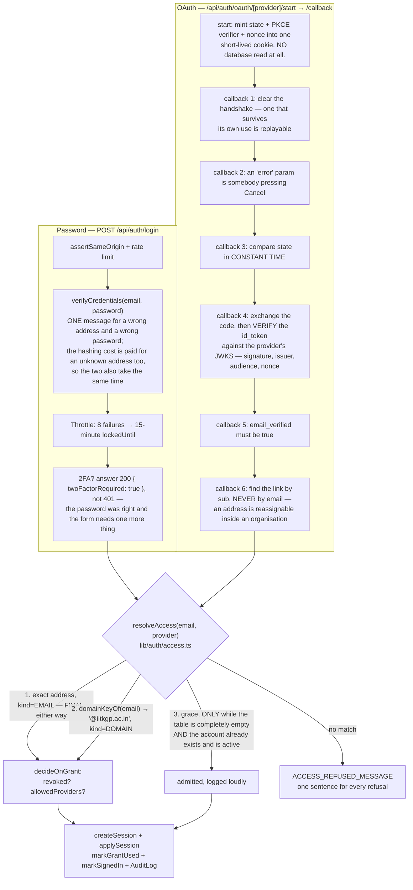

**Why the allow-list exists at all.** A password login is self-limiting — an account has to be
created first. An OAuth login is not: "Continue with Google" means every Google account on earth can
reach the callback, and a naive implementation creates a user for whoever arrives. `StudioAccess` is
consulted by *both* paths, and both refuse identically.

⚠ **The grace path is conditional on the list not being in use yet, and that condition is what makes
it safe.** An earlier version admitted any already-active account whose grant was missing, which made
the list mean two different things: *revoking* a grant refused the person (the row is found and
`revokedAt` is set) while *deleting* it admitted them again. A master admin who removes somebody and
watches them sign in has been handed a control that does not control anything. The condition is a
`count()`, so it is derived from the data and stops being permissive the moment somebody adds the
first person.

⚠ **Every refusal shows the same sentence**, whether the address is absent, revoked, or using a
provider that grant does not allow. Distinguishing them would turn the sign-in page into a directory
of who works at the Centre — precisely what an attacker wants before a phishing attempt. The real
reason goes to the audit log.

⚠ **A domain grant is the widest thing anybody can write in this product.** `@iitkgp.ac.in` admits
every present and future holder of an address there, at `grantedRole`, without a master admin ever
seeing their name. That is the point of it, and it is why an exact address is consulted first and its
answer is final, and why one typed at a public mail provider would open the CMS to the world.

`assertSameOrigin()` is deliberately **not** called on the OAuth callback: that request is by
construction a cross-site top-level navigation, so refusing a foreign origin would refuse every real
sign-in. The constant-time `state` check takes its place and is the stronger control — it proves the
callback belongs to a handshake *this server opened for this browser*, which an `Origin` header
cannot.

### 5.2 Sessions: two cookies, one hint, and single-use refresh

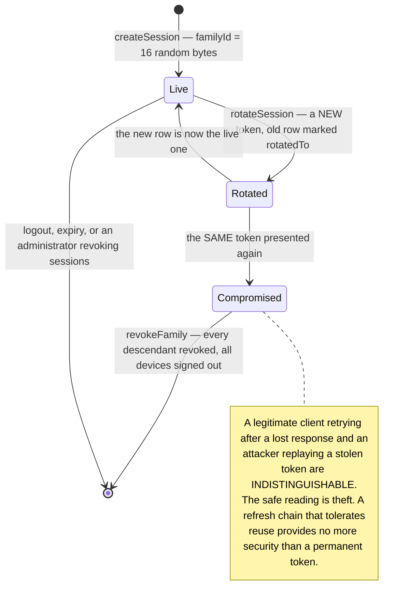

| Cookie | httpOnly | Holds | TTL |
|---|---|---|---|
| `cxa_access` | yes | A `jose` JWT: `sub`, `role`, `email`, `name`, `sid`, `typ:"access"`, issuer `cxa-portal`, audience `cxa-studio` | `ACCESS_TOKEN_TTL_MINUTES`, 30 by default |
| `cxa_refresh` | yes | 32 bytes of CSPRNG, base64url. **The token is never stored — only its SHA-256** | `REFRESH_TOKEN_TTL_DAYS`, 30 by default |
| `cxa_session_hint` | **no** | An expiry timestamp and nothing else — no token, no role | same as refresh |

`SameSite=Lax` is the CSRF control for the whole CMS, and it is not `Strict` on purpose: Strict also
withholds cookies from an ordinary top-level link, so an administrator following "review this draft"
from an email would land on the login screen despite holding a valid session. `secure` follows
`NODE_ENV` rather than being hardcoded, because a `Secure` cookie is silently dropped over plain http
and local development would look like a broken login with no error. The clear-options object repeats
path, domain, `secure` and `sameSite` exactly, because a clear that differs in any attribute creates
a *second* cookie instead of deleting the first — a "log out" that logs nobody out.

⚠ **Middleware refuses to spend a refresh token on a speculative request.** Next prefetches studio
links on hover and several prefetches can be in flight at once; two of them racing through the
refresh route would trip the reuse detector and sign the editor out of every device *while they were
moving the mouse*. `isSpeculative()` checks `next-router-prefetch`, `purpose` and `sec-purpose`, and
answers a bare 401 instead.

⚠ **An `/api/studio/*` caller is never redirected**, even when a refresh could succeed. `fetch`
follows a redirect transparently and would arrive at the refresh route having lost the method and the
body of a `POST`; the caller would then receive the redirected `GET`'s answer and report a save as
successful. So the API branch answers 401 JSON, and `lib/client/fetcher.ts` refreshes **once, through
a single shared promise** and replays the original request.

`verifyAccessToken` returns `null` for *every* failure — expired, forged, wrong audience, wrong
`typ` — so there is exactly one branch at every call site and no way for one kind of bad token to
fall through. `algorithms` is pinned to the single configured algorithm; leaving it open is what
makes algorithm-confusion attacks possible.

### 5.3 Roles

Six tiers on the editorial ladder plus a seventh above them, strictly ordered, with the numeric ranks
in `lib/permissions.ts` as the **single** source of comparison — adding a tier means adding it there
and nowhere else, because a second hand-rolled rank test that disagrees with the first is how a
"professor may edit anyone below" rule silently stops matching:

`VIEWER 10 · AUTHOR 20 · MEDIA_MANAGER 30 · RESEARCHER 40 · EDITOR 50 · ADMINISTRATOR 60 ·
MASTER_ADMIN 70`

`MASTER_ADMIN` sits *above* administrator rather than beside it, deliberately: an administrator
manages the site, a master admin manages who is allowed near it. Keeping them apart means the
day-to-day account — the one actually used, and therefore the one most likely to be compromised —
cannot widen the circle of people who can sign in.

`User.canPublish` and `User.canManageMedia` are per-user grants that **widen** a role and never
narrow it: `lib/permissions.ts` ORs them into the rank test, so a grant is additive and a demotion
always takes effect immediately.

A refusal inside a **Server Component** calls `requireStudioCapability` → Next's `forbidden()` →
`app/studio/forbidden.tsx` with a real 403, enabled by `experimental.authInterrupts` in
`next.config.ts`. Throwing an `ApiError` there instead becomes an unhandled server error and a 500
telling an editor "something went wrong on our side" — which is false, and `error.tsx` cannot repair
it because Next redacts a server error's message in production.

---

## 6. Cross-cutting mechanisms

### 6.1 Every write is audited, most are versioned

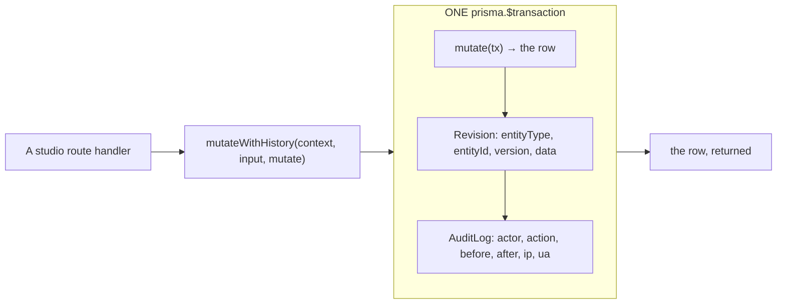

**The log entry and the change it describes are written in the same transaction.** A log that can
exist without the change — or the reverse — is a log nobody can trust during an incident, which is
the only time anybody reads it. `before` and `after` hold the **full serialised entity** rather than
a diff: a diff is only as good as the differ that produced it, and "restore version 4" needs the
whole prior state anyway. `redact()` strips `passwordHash`, `twoFactorSecret`,
`twoFactorRecoveryCodes`, `refreshTokenHash` and the storage keys by name, recursively — an audit log
is read by more people than the users table is, and it is exported.

`revise: false` marks a mutation that should be logged but not versioned: a delete, a reorder.

### 6.2 Soft delete, everywhere, and the one thing that hard-deletes

Content models carry `deletedAt`; the recycle bin is `deletedAt IS NOT NULL`. **Every read path must
filter on it** — use `livePublishableWhere()` or `liveStatusWhere()` rather than hand-rolling it,
because a hand-rolled filter is one somebody forgets once. They are two functions and not one clever
generic on purpose: referencing a column a model does not have (`publishAt`) is a Prisma **runtime**
error, not a type error. There is a third, `activeAnnouncementWhere()` in `lib/announcements.ts`,
kept apart for the same reason.

`npm run leak-check` exists because a draft leaking to the public site is an omission across ninety-odd
queries, which review misses structurally.

The only writer of a real `DELETE` is `/api/cron/purge`, and only for media soft-deleted longer than
`MEDIA_PURGE_AFTER_DAYS` (30). A window shorter than a working fortnight turns "restore the
photograph we deleted before the holidays" into a permanent loss.

### 6.3 Preview

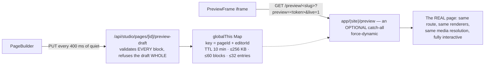

Two gates, and neither alone is enough: a valid `pagePreviewToken` for the slug — an HMAC over the
slug with the server secret, so rotating `JWT_SECRET` invalidates every outstanding link at once —
**and** a signed-in user whose own id is the `editorId`. The token is stable and shareable by design,
so a forwarded link must not carry somebody's unsaved work with it; and a session alone is not
authority to read a preview.

⚠ **The route lives under `(site)`, not under `/studio`, and the placement is the design.** It
renders inside the real site layout, so the preview is the design being reviewed rather than an
approximation of it; and it is outside the middleware matcher, so the signed token is genuinely the
gate. Putting it under `/studio` would wrap every preview in the CMS chrome, because a route group
cannot escape a parent layout. It is an **optional** catch-all, `[[...slug]]`, because the homepage's
slug is the empty string — and the homepage is the page most likely to be previewed before
publication.

The 400 ms debounce is the whole design: ordinary prose is typed at roughly 150–250 ms between
keystrokes, so anything at or below 250 fires mid-word; above about 500 a person stops attributing
what appears on screen to what they just typed.

### 6.4 Search, settings, feeds

- **`SearchDocument`** is one denormalised row per publishable entity, rebuilt on write inside the
  same transaction as the content (`lib/search/index.ts`). `body` is **plain text**, markup stripped,
  so a query never matches a JSON key name out of a Tiptap document.
- **`Setting`** is `key → Json`, one row per *group*, each group validated by a Zod schema in
  `lib/settings/schema.ts`. `getSettingsCached` / `getSettingCached` are `cache()`-wrapped so a
  layout and a page share one read per request.
- **Feeds and calendars are code, not content**: `app/(site)/news/feed.xml`,
  `app/(site)/news/atom.xml`, `app/(site)/events/calendar.ics`, `app/sitemap.ts`, `app/robots.ts`,
  and a per-entity `opengraph-image.tsx` on each detail route.

### 6.5 The verification layers

`npm run check` = `typecheck` + `lint` + `route-check` + `font-check` + `theme-check`. CI
(`.github/workflows/ci.yml`) runs the first three ahead of everything else, because they fail in
about two minutes with no database and no build, and only then pays for a migrate, a seed, a build, a
server and the two runtime checks:

- **`npm run smoke`** exists because typecheck, lint and route-check were **all green** while
  twenty-odd studio routes were unreachable. Nothing but a real request against a real server catches
  that.
- **`npm run leak-check`** exists because a draft leaking to the public site is an omission across
  ninety-odd queries.

⚠ **`font-check` and `theme-check` are in `npm run check` but not in `ci.yml`**, so they are yours to
run locally. Both catch a class of defect every other gate is blind to *by construction*:
`theme-check` finds a themed ink token used as a **scrim** under unconditionally-coloured text —
`bg-ink-900/55` with `text-white` is near-black in the light theme and near-*white* in the dark one,
so it shipped five times, including on the CC BY attribution chip whose entire job is to satisfy a
licence. `font-check` compares the generated manifest in `lib/typography/fonts.ts` against the bytes
actually on disk: a deleted `.woff2` compiles, lints and builds perfectly, and the first person to
notice is a reader who gets Georgia where Lora was specified.

Object storage is deliberately **unset** in CI: the application must run without it and report that
uploads are disabled (`configurationWarnings()` in `lib/env.ts`), and CI is the right place to prove
that holds. `JWT_SECRET` is not, and cannot be, a placeholder even there — `lib/auth/config.ts`
refuses to start on a secret that is short, placeholder-shaped, or built from too few distinct
characters, so the CI value is genuine entropy.

---

## 7. Where to change what

| You want to | Touch | Do **not** touch |
|---|---|---|
| Add a block type | `SectionType` enum · `lib/sections/schema.ts` · `lib/sections/registry.ts` · `components/sections/` · `components/studio/sections/` | Any migration beyond the enum value — the payload is JSON by design |
| Change what a showcase fetches | `lib/sections/resolve.ts` **only** | The renderer — renderers are pure and never query |
| Change how a block looks | `components/sections/<X>Section.tsx` | The schema, unless the data genuinely changed |
| Add a content type | `prisma/schema.prisma` · `lib/studio/crud.ts` helpers · a studio route pair · `lib/search/index.ts` | `lib/sections/*` — a content type is not a block |
| Change publication rules | `lib/content.ts` (read time) **and** `publishTransition` in `lib/studio/crud.ts` (write time) | The cron alone — it is a convenience, not the mechanism |
| Change who may sign in | `lib/auth/access.ts` · Studio → Studio access | `middleware.ts` — it decides routing, never authorisation |
| Change a permission | `lib/permissions.ts` **only**, then use it on the client *and* in the handler (contract §7) | Any second hand-rolled rank test |
| Add an upload type | The allow-list in **all three** of `lib/client/upload.ts`, `media/presign/route.ts`, `media/complete/route.ts` | Nothing — they are restated rather than imported because the client module is `"use client"` |
