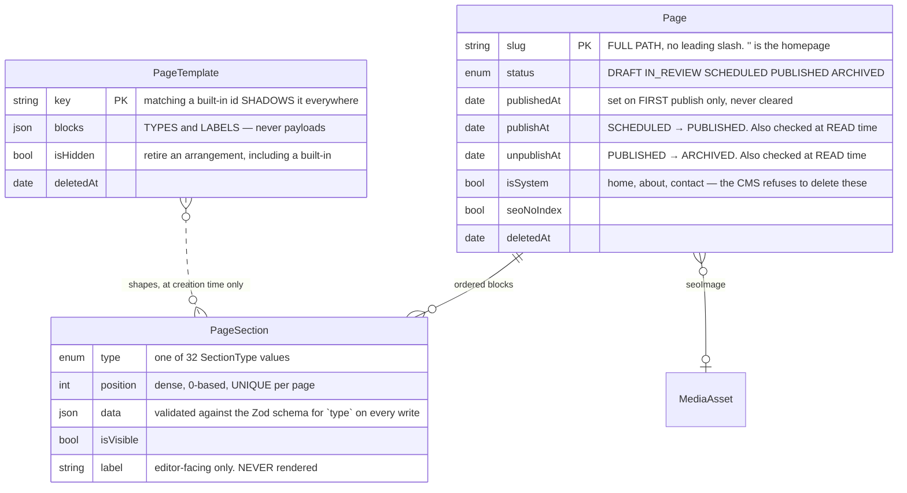
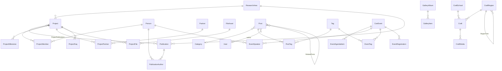
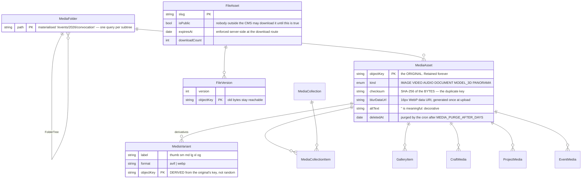
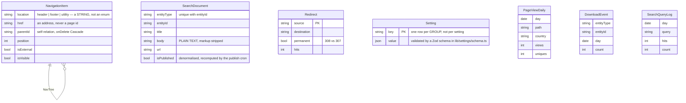
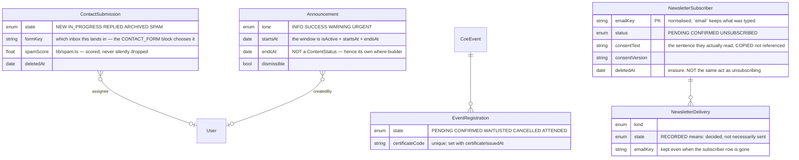

# Data model

56 models and 17 enums in `prisma/schema.prisma`, which is the authoritative document — every model
there carries a `///` comment explaining itself, and this file exists to show the **shape between
them** and to argue the handful of decisions that are not obvious from a single model in isolation.
Where the two disagree, the schema is right.

For how the data is *used* see [`ARCHITECTURE.md`](./ARCHITECTURE.md); for the request path see
[`REQUEST-LIFECYCLE.md`](./REQUEST-LIFECYCLE.md).

---

## 0. The two conventions that run through every table

**1. Soft delete.** Content models carry `deletedAt`; nothing user-facing is ever hard-deleted by the
CMS. The recycle bin *is* `deletedAt IS NOT NULL`. Every read path must filter on it, and must do so
through `livePublishableWhere()` or `liveStatusWhere()` from `lib/content.ts` rather than by hand —
they exist so no call site hand-rolls the filter and forgets it once. ⚠ **They are two functions and
not one clever generic on purpose:** referencing a column a model does not have (`publishAt`,
`unpublishAt`) is a Prisma **runtime** error, not a type error, so the mistake would be discovered by
a visitor rather than by the compiler. `Announcement` needs a third, `activeAnnouncementWhere()` in
`lib/announcements.ts`, because its window is `isActive` / `startsAt` / `endsAt` and not a
`ContentStatus` at all.

The only writer of a real `DELETE` is `/api/cron/purge`, and only for media soft-deleted longer than
`MEDIA_PURGE_AFTER_DAYS` (30 by default).

**2. Audited mutation.** Every write goes through `lib/audit.ts`, which writes the row, a `Revision`
and an `AuditLog` entry **inside one transaction**. A log that can exist without the change — or the
reverse — is a log nobody can trust during an incident, which is the only time anybody reads it.

**A note on `Decimal`:** nothing in this schema uses it. Prisma's `Decimal` arrives over JSON as a
*string*, which is a trap the sibling product fell into; money and coordinates are `Float`/`Int`, and
where precision matters the value is stored as a string with its unit alongside
(`Project.fundingAmount`, `Publication.pages`).

---

## 1. Identity, access and the trail

```mermaid
erDiagram
    User ||--o{ Session : "refresh-token families"
    User ||--o{ OAuthAccount : "linked identities"
    User ||--o{ AuditLog : "acted"
    User ||--o{ Revision : "authored"
    User ||--o{ ContentLock : "holds"
    User ||--o{ StudioAccess : "added / revoked"
    User }o--o| MediaAsset : "avatar"

    StudioAccess {
        string email PK "an ADDRESS, or a DOMAIN carrying its leading @"
        enum   kind "EMAIL | DOMAIN"
        enum   grantedRole "the role the account is CREATED with, once"
        enum   allowedProviders "empty means any configured method"
        date   revokedAt "set, never deleted"
        date   lastSignInAt "answers: is this grant still used?"
    }

    User {
        string email PK
        enum   role "VIEWER 10 .. MASTER_ADMIN 70"
        bool   canPublish "WIDENS the role, never narrows it"
        bool   canManageMedia "same"
        string twoFactorSecret "encrypted at rest by lib/auth/totp.ts"
        int    failedLogins "8 → lockedUntil, 15 minutes"
    }

    Session {
        string refreshTokenHash PK "SHA-256. The token itself is NEVER stored"
        string familyId "rotation preserves it; reuse revokes the whole chain"
        string rotatedTo "set on rotation"
    }

    OAuthAccount {
        string providerAccountId "the provider's sub claim — the stable key"
        string email "for display and audit ONLY, never for lookup"
    }

    AuditLog {
        json before "the FULL prior entity, not a diff"
        json after  "the FULL new entity"
        string actorEmail "denormalised, so a deleted user does not erase the trail"
    }

    Revision {
        string entityType "polymorphic"
        string entityId
        int    version
        json   data
    }

    ContentLock {
        string entityType "advisory, with a HARD 5-minute expiry"
        string entityId
        date   expiresAt "refreshed by a 60-second heartbeat"
    }
```

### `StudioAccess` — one column, two kinds of grant

`email` holds an address (`ada@example.org`) when `kind` is `EMAIL` and a domain **carrying its
leading `@`** (`@iitkgp.ac.in`) when it is `DOMAIN`. Two nullable columns were considered and are
worse in three specific ways:

- **Uniqueness.** Postgres does not compare `NULL`s, so two nullable unique columns cannot express
  "this row is listed exactly once" — a domain could be added twice as `(NULL, '@x.ac.in')` and the
  index would permit both. Which grant the sign-in path found would then be a coin toss, and so would
  the role somebody got.
- **Every reader.** The audit log's `entityLabel`, the duplicate 409, the sign-out lookup, the
  console's row label and `resolveAccess` itself all read one identity string today. A second column
  makes each of them a two-branch expression, and the branch somebody forgets is the one that logs an
  empty label against the widest grant on the list.
- **Collision.** The `@` is **stored, not stripped**, so a domain key can never equal an address key:
  a real address always has a local part in front of its `@`. It is also what makes the sign-out
  lookup an exact suffix match — `endsWith` on `@iitkgp.ac.in` cannot sweep in `evil-iitkgp.ac.in`,
  which a bare `iitkgp.ac.in` would.

`kind` is therefore the *answer*, not a duplicate of it, and `lib/auth/access.ts` requires it to
agree with the shape before honouring a domain match — a hand-edited row fails closed.

`grantedRole` applies **once**, at account creation on first sign-in. Re-reading it later would
silently undo an administrator's promotion or demotion on the user's next visit.

⚠ There is deliberately **no index on `kind`**. Every lookup that matters goes through the unique
index on `email`, because a domain is stored as a key rather than derived at query time. A two-value
enum on a table with tens of rows is the textbook case where the planner picks a sequential scan
anyway.

### `Session` — a family, not a row

The refresh token is 32 bytes of CSPRNG output and **only its SHA-256 is stored**, so a database leak
yields nothing replayable. `familyId` survives rotation, which is what makes "revoke this login and
every descendant of it, without touching the user's other devices" expressible at all. Presenting an
already-rotated token revokes the whole family: a legitimate retry after a lost response and an
attacker replaying a stolen token are indistinguishable, and the safe reading is theft.

### `Revision` — polymorphic on purpose

`(entityType, entityId, version)` rather than one revision table per model. A per-model table would
mean a migration for every new content type, which is precisely what the section model exists to
avoid. `data` is the full serialised entity, so "restore version 4" is a write of `data` and not a
replay of diffs.

---

## 2. Pages and the typed section model

### `PageSection.data` is the whole hybrid

`Page` owns routing, SEO and publication state. `PageSection` owns ordered, typed content whose
payload is a `Json` column — so **a new homepage section or a new layout is a new `SectionType` value
and a renderer, never a migration.** Everything a researcher actually curates (people, projects,
publications, news, events, crafts, media) stays a first-class relational table, because those are
queried, filtered, sorted and cited: burying them in JSON would make "publications by year, by
author" a full-table scan over a document blob.

`@@unique([pageId, position])` plus a dense ordering is why a reorder is **one** request carrying the
whole new order. N independent updates can interleave, two blocks then claim one position, and the
constraint refuses one of them *after* some of the others have landed — leaving the page
half-reordered with no record of what happened.

⚠ **`PageSection` has no `deletedAt`.** A deleted block does not go to the recycle bin; the studio's
confirm dialog says so in as many words. Its `Revision` rows survive it, which is the only trace
left.

⚠ **`data.anchor` sits outside every schema**, so validation strips it. The studio merges it back on
the client *and* the server handler must put it back too (`mergeSectionData` in
`lib/sections/anchor.ts`), or the client's merge is undone one layer down.

### `PageTemplate` holds block **types**, never block **payloads**

`blocks` is an ordered list of `{ type, label, purpose, overrides }`. Every payload is built at the
moment of use by `defaultSectionData()` and then validated by `parseSectionData()`. Two properties
follow, and both are why this table is not "a page to clone":

- **A template cannot go stale.** When a block's schema gains a field or changes a default, every
  template — including one an administrator wrote eighteen months ago — follows on its next use. A
  table of stored payloads would keep handing out last release's shape forever.
- **Every payload is valid by construction**, so a template can never produce the editor-only error
  card that an unparseable `PageSection.data` renders as.

`overrides` is the narrow exception, and it is merged over the seed and **re-parsed** — so an
override naming a field that no longer exists is stripped by `z.object()` rather than failing. A
template can lose a nicety across a schema change; it can never produce an invalid page.

---

## 3. The curated content graph

These are the tables the showcase blocks read, and the reason they are relational rather than JSON.

### The columns that decide what a showcase can do

| Model | Has `publishAt` / `unpublishAt`? | `isFeatured`? | Notes |
|---|---|---|---|
| `Page` | **yes** | no | `livePublishableWhere()` |
| `Post` | **yes** | yes | `livePublishableWhere()` |
| `Person` | no | no | `liveStatusWhere()`; ordered by `sortOrder`, which is the promise its help text makes |
| `ResearchArea` | no | no | `liveStatusWhere()`; `sortOrder` |
| `Project` | no | yes | `liveStatusWhere()`; also `state: PROPOSED / ACTIVE / COMPLETED / ON_HOLD`, a *different* axis from `status` |
| `Publication` | no | yes | `liveStatusWhere()`; `year` + `kind` are the indexed pair |
| `CoeEvent` | no | yes | `liveStatusWhere()`; `startsAt` decides upcoming vs past |
| `Craft` | no | yes | `liveStatusWhere()` |
| `GalleryAlbum` | no | no | `liveStatusWhere()` |
| `Partner` | **no `status` at all** | no | Gates on `isVisible` |
| `FileAsset` | **no `status` at all** | no | Gates on `isPublic` + `expiresAt` |

⚠ The last two rows are why `lib/sections/resolve.ts` cannot apply one filter uniformly. Calling
`liveStatusWhere()` on `Partner` is a Prisma **runtime** error, not a type error.

⚠ **`Project.state` and `Project.status` are two different things** and the naming is unfortunate but
deliberate: `status` is publication (is it on the site?), `state` is the project's own life cycle (is
the work running?). A project-showcase block filters on `state` and is *still* subject to `status`.

### Publications: `authorLine` beside `PublicationAuthor`

`Publication.authorLine` is free text and `PublicationAuthor` is a relation to `Person`. Both exist
because both are true: the citation must print the author list **exactly as published**, including
the co-authors who have never been near this CMS, while "papers by this person" needs a join. One
cannot be derived from the other.

### `Tag` is shared; `Category` is not

`Tag` joins to both `Post` and `CoeEvent`, so "heritage textiles" means one thing across the site and
the merge endpoints (`/api/studio/news/tags/[id]/merge`) can fold duplicates. `Category` belongs to
news alone and is a single-select — a piece has one home section.

---

## 4. Media, derivatives and files

### The original is never a variant row

"Delete every variant and regenerate" is therefore always safe, and it is safe *repeatedly*, because
`buildVariantKey` derives a derivative's key from the original's. A regeneration lands on the same
keys, so the CDN serves the improved bytes at URLs already embedded in published pages — no
cache-busting query string, no stale references.

### `checksum`, not `fileName`

The duplicate detector compares SHA-256 of the bytes. `IMG_0421.jpg` collides constantly; identical
bytes almost never do. A duplicate is **reported, not silently merged** — the administrator decides
whether to keep both.

### Every back-relation to `MediaAsset` is `onDelete: SetNull` at the referring side

Removing a photograph must never cascade into deleting the article that used it. The exceptions are
the join tables (`ProjectMedia`, `EventMedia`, `CraftMedia`, `GalleryItem`,
`MediaCollectionItem`), where the row *is* the association and has no meaning without both ends.

### `FileAsset` is versioned; `MediaAsset` is not

Replacing a dataset issues a new `FileVersion` and leaves the old bytes reachable, so a citation of
"v2 of the Bagru corpus" does not silently start resolving to v3. A photograph has no such
obligation, so replacing one re-runs the derivative pipeline in place.

---

## 5. Search, redirects, navigation, settings and analytics

### `SearchDocument.isPublished` is the one denormalisation that needs a job

It is computed at **write** time, but publication is resolved at **read** time from `publishAt` /
`unpublishAt` — so it goes stale with nothing more than the clock advancing. Two visible symptoms: a
page past its `unpublishAt` 404s at its own URL while its title keeps coming back from `/search` and
`/api/public/suggest`, and a scheduled article goes live at its minute but stays missing from the
site's own search until somebody re-saves it. `resyncPublishedFlags()` inside `/api/cron/publish`
recomputes from the source rows rather than from what that pass happened to transition, so a
deployment whose cron has been down converges on its first run afterwards.

`body` is plain text with markup stripped (`plainTextFromSections`, `plainTextFromMdx`) so a query
never matches a JSON key name out of a Tiptap document.

### `Redirect` exists because an institutional URL outlives an editor's filing decision

A page address is quoted in papers, syllabi and emails written years earlier. `app/(site)/[...slug]`
checks this table **before** it 404s, and `permanent` decides 308 (replace the old address in caches,
bookmarks and indexes) versus 307 (do not).

### `NavigationItem` — the one ordered tree with no constraint holding it up

Every menu on the site is rows in this table: `location` separates the header, the footer columns and
the utility bar, so one studio screen drives all three. `getNavigation()` in
`lib/navigation-server.ts` reads the whole table in **one** query and assembles the tree in memory —
a recursive query per level would be three round trips for a two-level menu, on every page.

Three things about it are worth knowing before you write to it:

⚠ **There is no `@@unique([location, position])`**, deliberately unlike `PageSection`'s
`@@unique([pageId, position])`. Nothing in the database would catch two rows both claiming position
3. That absence is why **both** writers rewrite an ordered set *whole, in one transaction* rather
than issuing N updates: `PUT`/`PATCH /api/studio/navigation` replaces the menus by description (every
row is created anew, so every row gets a new id), and `PATCH /api/studio/navigation/order` moves the
**existing** rows by id and touches only `position` and `parentId` — a drag that changed thirty ids
would invalidate every reference to them and rewrite thirty audit payloads to record a change of
position. The order body must name **every** item in the location; a set missing one is refused
rather than half-applied. `position` is not sent at all: it is the index among the items sharing a
`parentId`, computed on the server, because a client could otherwise send two 3s and no 4 and leave
the server deciding what that meant.

⚠ **The depth cap and the cycle check live in the route, not in the schema.** The self-relation
`NavTree` permits an item to be its own ancestor, which would make the tree builder recurse forever —
the site's *header* would hang rather than render, on every page. Two levels is the ceiling the
editor and the renderers can show; a third level in a header menu is a level nobody finds, and the
one a CMS lets an administrator create by accident. `onDelete: Cascade` here (contrast
`CraftRegion`'s `RegionTree`, which is `SetNull`) because a sub-item has no meaning without the item
it sits under.

**`location` is a plain `String`, not an enum**, so a row can hold a fourth value — and one that
does is *stranded*: `buildTrees()` drops it from every menu and reports it back to the studio as a
`stranded` count, so an item that has silently stopped appearing is named on screen instead of being
hunted for in the database.

**No rows is not emptiness.** A fresh installation has none, and a site with an empty header looks
broken rather than new, so `getNavigation()` falls back to `DEFAULT_HEADER` / `DEFAULT_FOOTER` in
`lib/navigation.ts` — which is also the path an unreachable database takes, because the site layout
calls this for every page the build renders and a throw here failed the whole build on whichever page
Next happened to prerender first. `prisma/seed.ts` writes the same defaults as real rows, so an
administrator can immediately edit what they see.

### `Setting` is one row per group

`key` is a group name, `value` is that whole group's JSON, and `lib/settings/schema.ts` holds a Zod
schema per group. `getSettingsCached` / `getSettingCached` are `cache()`-wrapped, so a layout and a
page cost one read per request rather than two.

### The analytics tables are pre-aggregated, and deliberately coarse

`PageViewDaily` is unique on `(day, path, country)` and `DownloadEvent` on
`(entityType, entityId, day, country)`. Nothing stores a per-visit row: there is no identifier to
join one to, day-and-country granularity answers every question the studio's analytics screen asks,
and the table cannot grow without bound with traffic.

---

## 6. Engagement: inquiries, registrations, announcements, newsletter

### The newsletter's four facts, which decide its whole shape

1. **Subscribing is a double opt-in.** A `POST` creates a `PENDING` row; only a confirmation link
   that was actually clicked promotes it to `CONFIRMED`. "The row exists" and "this person asked to
   hear from us" are two different statements, and only `status` carries the second. Every read
   meaning "who would a mailing go to" must filter on `status = CONFIRMED`, never on the presence of
   a row.
2. **Unsubscribing is not deleting.** An `UNSUBSCRIBED` row is a **suppression record** — the
   evidence that this address asked to be left alone. Deleting it would leave the next import or the
   next sign-up form with no way to know. `deletedAt` is a different act entirely: an erasure
   request, where the person has asked to be *forgotten* rather than merely left alone, and it is the
   only one that loses the suppression.
3. **The consent record is evidence, and is therefore copied rather than referenced.**
   `consentText` holds the sentence the person actually read, in full, at the moment they agreed to
   it. Editing the wording next year must not silently rewrite what everybody who signed up this year
   is recorded as having agreed to. `consentVersion` is kept alongside so a whole cohort can be
   found.
4. **Delivery is a seam, not a feature of this schema.** No provider is configured, so
   `NewsletterDelivery` is an **outbox**: one row per message this application *decided* to send,
   whether or not anything sent it. A `PENDING` subscriber with a `RECORDED` confirmation row is a
   person waiting for an email nobody has sent — which is a fact the studio can show and act on, and
   exactly what would otherwise be invisible.

### `ContactSubmission.spamScore` scores rather than drops

`lib/spam.ts` records a score and a reason on the row and files it as `SPAM`; nothing is discarded
silently. A false positive on an enquiry from a funder is not recoverable if the message never
existed.

---

## 7. The enums, in one place

| Enum | Values | Where the meaning lives |
|---|---|---|
| `Role` | `VIEWER` `AUTHOR` `MEDIA_MANAGER` `RESEARCHER` `EDITOR` `ADMINISTRATOR` `MASTER_ADMIN` | Ranks in `lib/permissions.ts` — the single source of comparison |
| `AuthProvider` | `PASSWORD` `GOOGLE` `MICROSOFT` `YAHOO` | `lib/auth/oauth.ts` |
| `AccessKind` | `EMAIL` `DOMAIN` | `lib/auth/access.ts` |
| `ContentStatus` | `DRAFT` `IN_REVIEW` `SCHEDULED` `PUBLISHED` `ARCHIVED` | `lib/content.ts` — labels, tones and `isLive()` |
| `AuditAction` | 14 values, from `CREATE` to `ROLLBACK` | `lib/audit.ts` |
| `SectionType` | 32 values | `lib/sections/registry.ts` for the palette, `lib/sections/schema.ts` for the payloads |
| `MediaKind` | `IMAGE` `VIDEO` `AUDIO` `DOCUMENT` `MODEL_3D` `PANORAMA` | The three upload allow-lists |
| `PersonKind` | `FACULTY` `SCIENTIST` `RESEARCH_ASSISTANT` `STUDENT` `STAFF` `VISITOR` `ALUMNUS` | People showcase's `kind` filter |
| `ProjectStatus` | `PROPOSED` `ACTIVE` `COMPLETED` `ON_HOLD` | ⚠ the project's own life cycle, **not** publication |
| `PublicationKind` | 10 values, `JOURNAL_ARTICLE` … `REPORT` | `lib/citation.ts` decides the citation form per kind |
| `EventMode` | `IN_PERSON` `ONLINE` `HYBRID` | |
| `RegistrationStatus` | `PENDING` `CONFIRMED` `WAITLISTED` `CANCELLED` `ATTENDED` | |
| `AnnouncementTone` | `INFO` `SUCCESS` `WARNING` `URGENT` | Colour never carries the meaning alone (contract §1.4) |
| `SubmissionStatus` | `NEW` `IN_PROGRESS` `REPLIED` `ARCHIVED` `SPAM` | |
| `SubscriberStatus` | `PENDING` `CONFIRMED` `UNSUBSCRIBED` | Three values, not a boolean pair — see §6 |
| `NewsletterMailKind` / `NewsletterMailState` | the outbox's two axes | |
