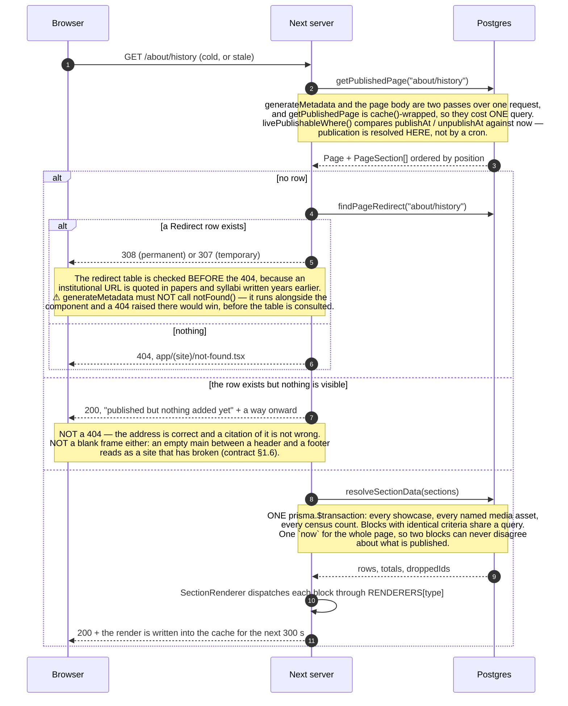
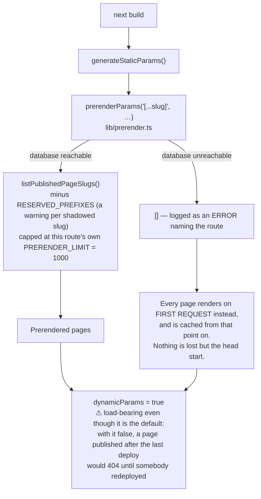
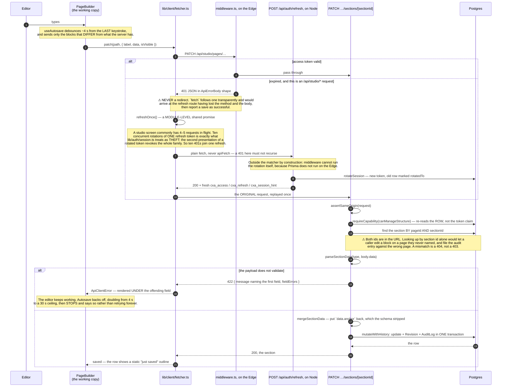
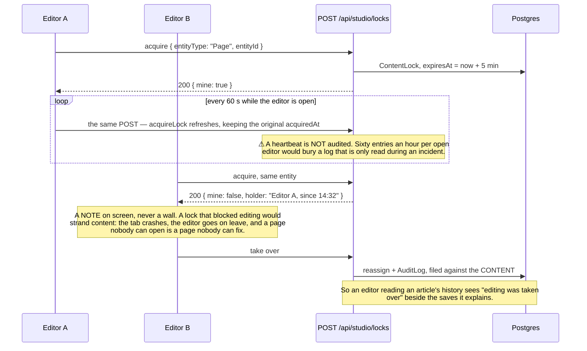
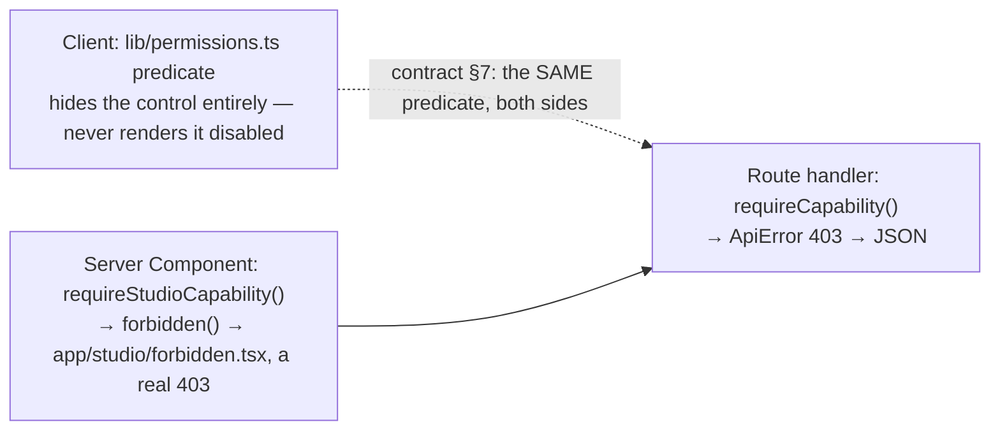
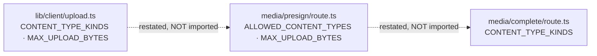

# Request lifecycle

What actually happens between a click and a row, for the three paths that carry almost all of this
application's traffic: a public page, a studio save, and a media upload. The structure is in
[`ARCHITECTURE.md`](./ARCHITECTURE.md); the tables are in [`DATA-MODEL.md`](./DATA-MODEL.md); this
file is the timing.

Each sequence is followed by the failure branches, because a happy path that nobody has traced a
failure through is a happy path that will be debugged in production.

---

## 1. A public page request

`/about/history` is a `Page` row whose `slug` is `about/history`, served by
`app/(site)/[...slug]/page.tsx`. **Middleware never sees this request** — its matcher is `/studio`,
`/studio/*` and `/api/studio/*` only — which is precisely what allows the response to be a cached
static render.

### 1.1 The cached hit, which is the ordinary case

```mermaid
sequenceDiagram
    autonumber
    participant B as Browser
    participant E as Edge / CDN
    participant O as Object store base

    B->>E: GET /about/history
    E-->>B: 200, the prerendered HTML — the app is not woken at all
    Note over B,E: This is the whole point of `export const revalidate = 300`.<br/>25 route files carry 300 s, pages and opengraph-image alike;<br/>the gallery detail carries 600 s; robots.ts, sitemap.ts and<br/>/api/public/stats carry 3600 s.
    B->>E: GET the RSC payload, the JS chunks, the fonts
    B->>O: GET the image bytes from NEXT_PUBLIC_CDN_URL
    O-->>B: the derivative, never routed through the application
```

### 1.2 The miss, or the first request after the window lapses



### 1.3 What happens at build, and what happens when the database is not there



⚠ **Returning `[]` is a complete fallback, not a swallowed error.** `generateStaticParams` is purely
an optimisation, and an empty list is exactly the behaviour of a route that has none. The alternative
— a failed build — loses the whole deploy for a reason unrelated to the change being shipped. This is
emphatically *not* the same as swallowing a database error at **request** time, where the honest
answer is a 500 and a loud log.

`prerenderSafe()` is the same guard for a page's *data* read rather than its list of paths, and ⚠ it
**must be paired with `export const revalidate`**: a page prerendered with the empty fallback would
otherwise serve that snapshot until the next deploy.

⚠ **`PRERENDER_LIMIT` is a per-route constant, declared in each route file rather than in
`lib/prerender.ts`** — 1000 for the CMS catch-all, 300 for events, 200 for news and for a gallery
album — because the right ceiling is a property of how heavy that route's render is, not of the
guard. Passing it is a `console.warn` and a `slice`, never a failure: the remainder render on demand
and are cached from that point on, which is slower on first visit and otherwise identical.
`generateStaticParams` also warns, by name, for every published slug it skipped because
`RESERVED_PREFIXES` owns its first segment — that page is published and unreachable, and the build
log is where a developer will actually see it.

`experimental.staticGenerationRetryCount = 1` in `next.config.ts` absorbs one transient blip. The
build generates pages in parallel and every worker opens its own Prisma pool against one forwarded
port; on a WSL-mirrored-networking dev box the stampede intermittently drops TCP connects, and one
failed page aborts the whole build. A page that fails **twice** is a real defect and still fails the
build, which is the contract.

### 1.4 The two things that are deliberately *not* on this path

- **No `searchParams`, no cookies, no headers.** Reading any of them inside
  `app/(site)/[...slug]/page.tsx` would opt every CMS page into per-request rendering and throw away
  both the prerender and the revalidation. Preview therefore lives on its own route (§4).
- **No `revalidatePath` / `revalidateTag` anywhere in the codebase.** Publication reaches the public
  site through the time window and nothing else. That is a deliberate simplification with a stated
  cost: an editor who publishes sees the change within five minutes, not instantly. If on-demand
  revalidation is ever added, the studio's own wording about "within a few minutes" has to change
  with it.

### 1.5 A code route always beats the catch-all

`/research` is `app/(site)/research/page.tsx`, with real filtering and pagination. A `Page` row that
claimed the slug `research` would replace a working listing with a hand-built imitation — except that
it cannot, because **a static segment always beats a catch-all in Next's own resolution order**.
`RESERVED_PREFIXES` in the catch-all is defence in depth and is about the *build*:
`generateStaticParams` must not offer a path a code route already prerenders, or two builders claim
one URL in the output. It also prints a warning naming the shadowed slug, so an editor who saved one
gets a loud line in the build log instead of a page that is plainly published and plainly
unreachable.

⚠ **Add to `RESERVED_PREFIXES` when you add a route under `app/(site)/`.**

---

## 2. A studio save

The page builder autosaves. The path below is one autosave cycle for a block whose words changed,
including the branch where the access token expired mid-edit — which is the branch that used to sign
people out.



### 2.1 The other three kinds of write from the same screen

| Kind | Endpoint | Shape |
|---|---|---|
| Add / duplicate / delete a block | `POST` / `DELETE` on `…/sections` and `…/sections/[sectionId]` | Immediate, never debounced. Somebody who pressed Delete expects it gone. Deleting closes the gap in the dense ordering, because leaving a hole makes the client's positions disagree with the server's on the next drag. |
| Reorder | `PATCH …/sections/order` | **One** request carrying the **whole** order, rewritten in a transaction. One in flight at a time, with a single pending slot holding the latest order. |
| Page settings and status | `PATCH /api/studio/pages/[id]` | Goes through `publishTransition()` and, for anything going public, `pagePublishBlockers()`. |
| Live preview draft | `PUT …/preview-draft`, 400 ms after the last change | Writes nothing to the database and audits nothing, because nothing has changed — a preview is a read. |

### 2.2 The lock, which never refuses anybody



### 2.3 Where a permission is actually enforced



⚠ **A client guard that only hides a control is not a guard.** And ⚠ a Server Component must not
throw an `ApiError`: it becomes an unhandled server error and a 500 telling an editor "something went
wrong on our side", which is false. Next redacts a server error's message in production, so
`error.tsx` cannot tell a refusal from a fault — which is exactly why
`experimental.authInterrupts` is switched on.

---

## 3. A media upload

Three steps, and the bytes never pass through the application. The shapes of all three are written
out in the header of `lib/client/upload.ts` **and** in the two route headers, deliberately duplicated,
because these are the two halves of one feature living in separate files.

```mermaid
sequenceDiagram
    autonumber
    participant U as Editor
    participant C as lib/client/upload.ts
    participant A as App
    participant S as Object store
    participant P as Postgres

    U->>C: drops 12 files
    Note over C: Client-side refusals first — over MAX_UPLOAD_BYTES (200 MB), or a<br/>content type outside the ALLOW-LIST. Refusing here saves the editor<br/>a 200 MB upload that was always going to fail.<br/>UPLOAD_CONCURRENCY = 3: twenty parallel PUTs on a domestic uplink<br/>make every one of them slow and the first failure ambiguous.

    loop per file, 3 at a time
        C->>A: POST /api/studio/media/presign
        A->>A: requireCapability(canManageMedia) · assertSameOrigin<br/>server-side allow-list and 200 MB cap (authoritative)<br/>buildObjectKey → media/YYYY/MM/&lt;16 hex&gt;-slug.ext
        Note over A,P: NOTHING is written to the database. A signed URL is a promise, not a fact.
        A-->>C: { uploadUrl, headers, objectKey, expiresInSeconds: 900 }

        C->>S: PUT uploadUrl — the raw File, `headers` replayed VERBATIM
        Note over C,S: ⚠ Content-Type is part of the SigV4 signature. Sending a different one<br/>returns SignatureDoesNotMatch, which reads as a credentials problem.<br/>XMLHttpRequest, not fetch — fetch still cannot report upload progress.<br/>Stall watchdog: reset on every progress event, 60 s idle;<br/>re-armed for 5 min after the last byte, because storage emits no<br/>progress at all while it finalises a large object.
        S-->>C: 200

        C->>A: POST /api/studio/media/complete
        A->>S: headObject(objectKey)
        alt the object is not there
            A-->>C: refused — trusting the browser's "done" is how a row ends up<br/>pointing at a key that was never written
        else the size disagrees with what was reported
            A->>S: DELETE the object
            A-->>C: 400 — the bytes are not the bytes that were described,<br/>and it is a key THIS endpoint issued, so nothing references it
        else the key is not one this endpoint could have issued
            A-->>C: 400 — ISSUED_MEDIA_KEY is a full pattern, not a prefix check,<br/>so a VARIANT key is rejected too
        else
            A->>S: GET the object bytes
            A->>A: SHA-256 (skipped above CHECKSUM_MAX_BYTES = 128 MB, and SAID SO)
            A->>P: byte-identical assets? reported, never silently merged
            A->>A: generateDerivatives — SEQUENTIALLY, skipped above DERIVE_MAX_BYTES = 80 MB
            A->>S: PUT thumb·sm·md·lg·xl·og × avif,webp
            A->>P: MediaAsset + MediaVariant[] + Revision + AuditLog — ONE transaction
            alt the transaction rolls back
                A->>S: DELETE the derivatives written a moment ago
                Note over A,S: A failure leaves the bucket as it was, rather than salting it<br/>with unreferenced files nobody will ever collect.
            end
            A-->>C: the created MediaAsset, WHOLE — it goes straight into the grid
        end
    end

    C-->>U: UploadResult { uploaded, failed }
```

⚠ **`uploadFiles` resolves with a populated `failed` list when *some* files fail; it throws only when
nothing landed.** A caller that treats a resolved promise as "all done" silently loses files — the
editor sees a success toast, the library is short two photographs, and nobody finds out until a page
is published with a gap in it. **Inspect `failed` and name the files.** `summariseFailures()` exists
so that sentence is not reinvented at each call site.

### 3.1 Where the allow-list lives, three times over



They are restated because `lib/client/upload.ts` is `"use client"`: importing it from a route handler
replaces the module with client references, and reading a plain constant from it fails at runtime.
The browser's copy exists to refuse a 500 MB file before a byte leaves the machine; the server's is
the one that actually matters. **All three must move together.**

### 3.2 Two upload failures that produce no application error at all

- **Bucket CORS.** The browser talks to the store directly, so the *bucket* decides whether it may.
  A missing policy fails at the `PUT` with nothing in the application's logs.
  ⚠ `ExposeHeaders: ["ETag"]` is the load-bearing line — a browser cannot read a header that is not
  exposed, and multipart identifies each part by its `ETag`. The symptom is not an error: it is large
  uploads becoming slow and fragile, which reads as a network problem. See `OPERATIONS.md` §1.
- **Storage unconfigured.** `requireStorage()` throws **503**, not 500 — it is a deployment state,
  not a bug — and `configurationWarnings()` says so on the Diagnostics screen. On the read side,
  `publicObjectUrl()` returns `null` and `MediaImage` draws a labelled placeholder, so an editor
  finds out rather than staring at an empty rectangle.

---

## 4. Appendix: the live preview round trip

Worth tracing once, because it is the only path where a render deliberately reads something that is
not in the database.

```mermaid
sequenceDiagram
    autonumber
    participant PB as PageBuilder
    participant D as PUT /api/studio/pages/[id]/preview-draft
    participant M as globalThis Map (per process)
    participant IF as PreviewFrame iframe
    participant R as app/(site)/preview, an optional catch-all

    PB->>D: the COMPLETE working copy, 400 ms after the last change
    D->>D: parseSectionData on EVERY block
    alt any block fails
        D-->>PB: refused WHOLE — a preview missing one block is a preview<br/>of a page that does not exist
        Note over PB: The loop goes to `paused` and shows the server's own sentence,<br/>keeping the last draft that got through. The next change re-arms it.
    else
        D->>M: store under pageId + editorId — TTL 10 min, ≤256 KB, ≤60 blocks, ≤32 entries
        D-->>PB: ok
        PB->>IF: bump the frame's src
        IF->>R: GET /preview/&lt;slug&gt;?preview=&lt;token&gt;&amp;live=1
        R->>R: previewTokenMatches — constant-time HMAC over the slug
        R->>R: currentUser() — the draft's editorId must be THIS user's id
        Note over R: ⚠ BOTH are required. The token is stable and shareable by design, so a<br/>forwarded link must not carry somebody's unsaved work; and a session<br/>alone is not authority to read a preview.
        R->>M: readPreviewDraft(pageId, editorId)
        alt found
            R-->>IF: the REAL page, rendered from the draft blocks
        else nothing (a different instance served this GET)
            R-->>IF: the last SAVED page + PREVIEW_DRAFT_FALLBACK_NOTICE
            Note over R,IF: ⚠ The degradation is announced. A preview that quietly showed<br/>yesterday's words while claiming to be live is worse than one that<br/>admits it is behind.
        end
    end
```

The store is a `Map` on `globalThis`, so on Vercel the `PUT` and the `GET` can land on different
instances. The real answer is a shared store with a TTL — a Redis `SETEX`, or the platform's own KV —
and `lib/ratelimit.ts` states the identical limitation about the identical mechanism. If one is ever
provisioned, both should move to it in the same change.
